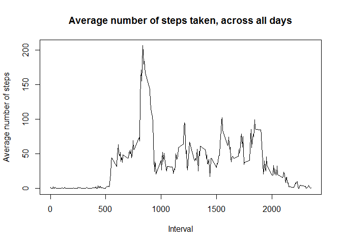
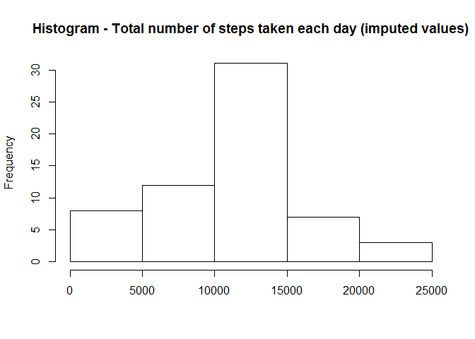
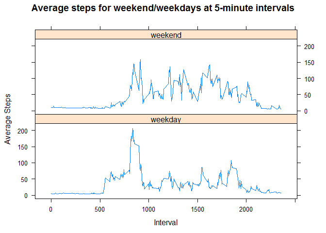

# Reproducible Research - Peer Assessment 1

### Introduction

It is now possible to collect a large amount of data about personal movement using activity monitoring devices such as a Fitbit, Nike Fuelband, or Jawbone Up. These type of devices are part of the "quantified self" movement -- a group of enthusiasts who take measurements about themselves regularly to improve their health, to find patterns in their behavior, or because they are tech geeks. But these data remain under-utilized both because the raw data are hard to obtain and there is a lack of statistical methods and software for processing and interpreting the data.

This assignment makes use of data from a personal activity monitoring device. This device collects data at 5 minute intervals through out the day. The data consists of two months of data from an anonymous individual collected during the months of October and November, 2012 and include the number of steps taken in 5 minute intervals each day.

### Data

The data for this assignment can be downloaded from the course web site:

* Dataset: [Activity Monitoring Data](https://d396qusza40orc.cloudfront.net/repdata%2Fdata%2Factivity.zip) (52K)

The variables included in this dataset are:

* **steps**: Number of steps taking in a 5-minute interval (missing values are coded as NA)

* **date**: The date on which the measurement was taken in YYYY-MM-DD format

* **interval**: Identifier for the 5-minute interval in which measurement was taken

The dataset is stored in a comma-separated-value (CSV) file and there are a total of 17,568 observations in this dataset.

## Assignment

The assignment will consist of several parts:

1. Loading and preprocessing the data.

1. Calculating the mean total number of steps taken per day.

3. Plotting the average daily activity pattern.

4. Imputing missing values.

5. Comparing the differences in activity patterns between weekdays and weekends.


### 1. Loading and preprocessing the data
1) **Load the data**

```r
unzip(zipfile = "activity.zip", exdir = "data", overwrite = FALSE)
setwd(sprintf("%s/data", getwd()))
activity <- read.csv(file = "activity.csv",header = TRUE)
```

2) **Process/transform the data**

Several libraries were loaded at this point.

```r
library(dplyr)
library(knitr)
library(lubridate)
library(lattice)
```

The data frame was wrapped using the dplyr package for ease data manipulation.

```r
activity <- tbl_df(activity)
```

The date column was modified to a date class, rather than a factor class.

```r
activity$date <- as.Date(activity$date)
```

### 2. Calculating the mean total number of steps taken per day

For this part of the assignment missing values in the dataset were ignored.

```r
activity_noNA <- activity[!is.na(activity$steps),]
```

1) **Calculate the total number of steps taken per day**

A new data frame was created for the total number of steps taken each day.

```r
steps_taken <- activity_noNA %>% 
                group_by(date) %>% 
                summarise(total_steps = sum(steps))
```

2) **Make a histogram of the total number of steps taken each day**

This is a histogram of the total number of steps taken each day
 

3) **Calculate and report the mean and median of the total number of steps taken per day**

The mean and median of the total number of steps taken per day were then calculated:

```r
total_steps_per_day <- sum(steps_taken$total_steps)
mean_steps_per_day <- mean(steps_taken$total_steps)
median_steps_per_day <- median(steps_taken$total_steps)
```

* Mean: **10766.19**

* Median: **10765**

### 3. Plotting the average daily activity pattern

1) **Make a time series plot (i.e. type = "l") of the 5-minute interval (x-axis) and the average number of steps taken, averaged across all days (y-axis) mutate the interval column into a time class**

First, the average steps taken for each interval must be calculated. This was
done by grouping the intervals and getting the mean for each step.

```r
avg_steps_at_intervals <- activity_noNA %>% 
                            group_by(interval) %>% 
                            summarise(avg_steps = mean(steps))
```


The time series plot was then created:

```r
plot(x=avg_steps_at_intervals$interval, 
     y=avg_steps_at_intervals$avg_steps, 
     type = "l", 
     xlab = plot2_xlab, 
     ylab = plot2_ylab, 
     main = plot2_title)
```

 

2) **Which 5-minute interval, on average across all the days in the dataset, contains the maximum number of steps?**

This was computed using the following:

```r
avg_steps_at_intervals %>% filter(avg_steps == max(avg_steps))
```

```
## Source: local data frame [1 x 2]
## 
##   interval avg_steps
## 1      835  206.1698
```


So, the answer to this question is interval **835**.

### 4. Imputing missing values

*As can be noted from the data, there are a number of days/intervals where there are missing values (coded as NA). The presence of which may introduce bias into some calculations or summaries of the data*

1) **Calculate and report the total number of missing values in the dataset (i.e. the total number of rows with NAs)**

We can calculate and report the total number of missing values in the dataset with the following:

```r
total_missing <- sum(is.na(activity))
```

The total number of missing values is **2304**.

2) **Devise a strategy for filling in all of the missing values in the dataset**

It was decided that the mean for the 5-minute interval was the most suitable value for substituting the missing values.

To do this, a new data frame was created to contain only the rows with missing values.

```r
all_NAs <- activity[is.na(activity$steps),]
```

Next, the data was then merged with the dataset created from finding the average steps for each interval (as was created earlier).

```r
mergedData <- merge(all_NAs, avg_steps_at_intervals)
```

3) **Create a new dataset that is equal to the original dataset but with the missing data filled in**

A new data set was then created for replacing the missing values, and the values were updated.

```r
activity_imputed <- activity
activity_imputed$steps[is.na(activity_imputed$steps)] <- mergedData$avg_steps
```

4) **Make a histogram of the total number of steps taken each day and calculate**

First, a new data frame is created for the total number of steps taken each day (with imputed values).

```r
steps_taken_imputed <- activity_imputed %>% 
                    group_by(date) %>% 
                    summarise(total_steps = sum(steps))
```

Using the newly created data set with imputed values, a new histogram can now be produced.
 

**Report the *mean* and *median* total number of steps taken per day**

```r
imputed_total_steps_per_day <- sum(steps_taken_imputed$total_steps)
imputed_mean_steps_per_day <- mean(steps_taken_imputed$total_steps)
imputed_median_steps_per_day <- median(steps_taken_imputed$total_steps)
```

* Mean: **10766.19**

* Median: **11015**


**Do these values differ from the estimates from the first part of the assignment?**

At first sight of the histograms, the differences appear to be negligible. However, there
is a difference.

To show the difference, we'll format the appropriate data into a data frame:

```r
total_values <- c("imputed"=imputed_total_steps_per_day, "original"=total_steps_per_day)
mean_values <- c(imputed_mean_steps_per_day, mean_steps_per_day)
median_values <- c(imputed_median_steps_per_day, median_steps_per_day)
difference <- data.frame(total_values,mean_values,median_values)
```

And show the difference, we'll output this data frame:

```
##          total_values mean_values median_values
## imputed      656737.5    10766.19         11015
## original     570608.0    10766.19         10765
```


This table shows that, whilst the **mean** has remained the same at **10766.19** steps per day, the **median** value has changed dramatically with a difference of **250** steps per day, and with that the **total** has also changed, with a huge difference of **86129.51** steps per day.

**What is the impact of imputing missing data on the estimates of the total daily number of steps?**

Using this form of imputing (i.e. calculating the missing values as being the mean of the 5-minute interval across all days), we get different results for the *total* and *median*, thus changing the data a lot. That said, the *mean* remains the same.

With that said, the impacts of imputing missing data appear to be dependant on what question is being asked. Obviously, missing data is not ideal and can make quite a difference, so perhaps under certain circumstances, replacing the missing data with estimates would be the right choice.

### 5. Comparing the differences in activity patterns between weekdays and weekends.

1) **Create a new factor variable in the dataset with two levels – “weekday” and “weekend” indicating whether a given date is a weekday or weekend day**

For this part, a new column was created to show weekend/weekday based on the date.

```r
activity_imputed <- activity_imputed %>%
                    mutate(day_type = ifelse(weekdays(date)=="Saturday", "weekend", 
                            ifelse(weekdays(date)=="Sunday", "weekend", "weekday")))
## the new column is changed to a factor
activity_imputed$day_type <- as.factor(activity_imputed$day_type)
```

A new data frame was then created to show the average number of steps for each interval on both weekdays and weekends.

```r
avg_steps_taken_weekday_weekend <- activity_imputed %>% 
                            group_by(day_type, interval) %>% 
                            summarise(average_steps = mean(steps))
```

2) **Make a panel plot containing a time series plot of the 5-minute interval and the average number of steps taken, averaged across all weekday days or weekend days**

The panel plot was created using the lattice graphics package.

```r
xyplot(average_steps ~ interval | day_type, 
       data = avg_steps_taken_weekday_weekend, 
       layout = c(1,2),
       type="l",
       xlab="Interval",
       ylab="Average Steps",
       main="Average steps for weekend/weekdays at 5-minute intervals")
```

 
